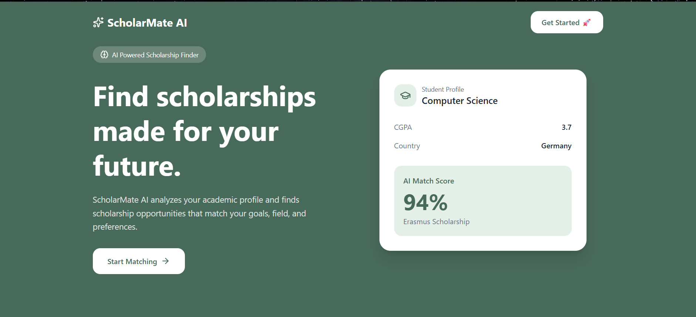

# 🎓 ScholarMate AI

ScholarMate AI is a modern web application that helps students discover scholarships based on their academic profile. It analyzes user preferences and recommends scholarships using a personalized matching algorithm.

## ✨ Features

- 🤖 AI-inspired scholarship matching
- 🎯 Personalized recommendations
- 🔍 Search scholarships by name, country, or university
- 📄 Detailed scholarship information
- 📱 Fully responsive design
- ✨ Smooth animations with Framer Motion
- 🎨 Modern UI built with Tailwind CSS

## 🛠️ Tech Stack

- React
- Vite
- Tailwind CSS
- React Router
- Framer Motion
- Lucide React

## 📸 Screenshots



## 🚀 Live Demo

[Live Demo](https://scholar-mate-ai-chi.vercel.app/)

## 🚀 Installation

```bash
git clone https://github.com/xuhaahmad/ScholarMate-AI.git

cd ScholarMate-AI

npm install

npm run dev
```

## 📸 Screenshots

### Home Page


### Profile Page


## 📂 Project Structure

```
src/
 ├── components/
 ├── pages/
 ├── data/
 ├── utils/
 └── App.jsx
```

## 👨‍💻 Author

**Zuha Ahmad**

BS Computer Science  
COMSATS University Islamabad

---

Made with ❤️ using React and Tailwind CSS.